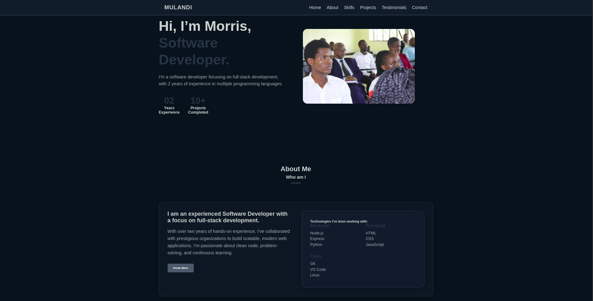

# 🚀 Morris Mulandi – Developer Portfolio

Welcome to my personal developer portfolio! This site showcases my background, skills, and projects in a clean, modern, and fully responsive layout. Built from scratch using HTML & CSS (no libraries, no JavaScript), this project highlights my front-end craftsmanship and creativity in pure code.

> 📌 Whether you're a recruiter, hiring manager, or fellow developer — thanks for stopping by!

---

## 🖼️ Preview

Here’s a quick look at the portfolio:




---

## 🌐 Live Demo

🔗 [View Portfolio Live](https://hackathon-1-lake.vercel.app/)


---

## ✨ Features

- 💻 Fully responsive on all screen sizes
- 🎨 Elegant dark theme with glassmorphism UI
- ⚡ Smooth CSS animations and transitions
- 🚫 No JavaScript, no libraries — 100% vanilla HTML & CSS
- 🧭 Scroll-snap and responsive navbar
- 📨 Functional contact form layout

---

## 🛠 Technical Features

- 💡 HTML5 semantic structure
- 🎨 Custom CSS with variables & reusable utility classes
- 📱 Mobile-first responsive design
- 🎬 CSS-only animations & transitions
- 🔒 Security-friendly external link handling (rel="noopener noreferrer")
- 🖼️ Images and assets managed locally
- 🧩 No build tools or frameworks required — runs directly in the browser

---

## 📁 Project Structure

```
portfolio/
├── index.html # Main HTML file
├── styles.css # Root-level custom CSS (dark theme + glassmorphism)
├── assets/
│ ├── img/ # Portfolio images and testimonials
│ └── icons/ # Optional SVG icons
└── resume.pdf # Optional resume link
```

---

## 📚 Section Overview

---

| Section         | Description                                                          |
| --------------- | -------------------------------------------------------------------- |
| 🏠 Home         | Hero intro with name, title, CTA, and hero image                     |
| 👤 About        | Brief background, experience summary, and technologies used          |
| 🎓Education     | Academic background and relevant credentials                         |
| 🧰 Skills       | Animated skill bars showcasing technical proficiencies               |
| 💼 Projects     | Portfolio items with visuals, descriptions, and external links       |
| 💬 Testimonials | Client or peer feedback shown in an interactive, scrollable carousel |
| 📬 Contact      | Contact form and social links for getting in touch                   |

## 🧪 Installation & Local Setup

To clone and run this locally:

1. Clone the repository:

   ```bash
   git clone https://github.com/111morris/hackathon_1.git
   ```
2. Open the folder:

    ```bash
   cd hackathon_1
   ```


* No setup required — just double-click or drag into your browser.

---

## 🤝 Contributing

   Contributions are welcome!

   If you spot a typo, styling issue, or have ideas to improve it:

1. Fork this repo
2. Create a branch (git checkout -b feature/your-feature)
3. Commit your changes (git commit -m "Add your changes")
4. Push to your fork (git push origin feature/your-feature)
5. Create a Pull Request ✅

---

## 📄 License

   This project is licensed under the MIT License.

   Feel free to use, modify, and share — just link back if you can!

---

## 📬 Contact

   Feel free to reach out:

* 📧 Email: [mulandimorris1@gmail.com](mailto:mulandimorris1@gmail.com)
* 🐙 GitHub: [111morris](https://github.com/111morris)
* 💼 LinkedIn: [Morris Mulandi](https://www.linkedin.com/in/morris-mulandi-619a18300/)

   Thanks again for visiting my portfolio! 🙌
